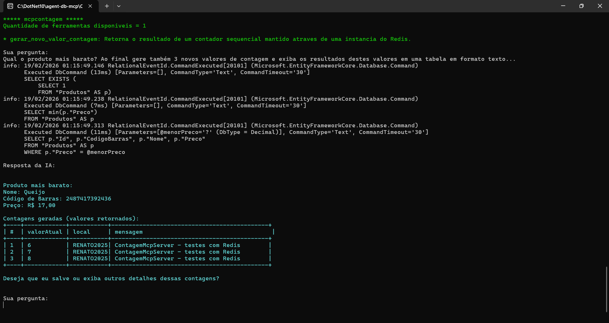

# dotnet10-agent-framework-postgres-testcontainers-mcp-otel-grafana_consultaprodutos
Exemplo em .NET 10 de Console Application que faz uso do projeto Microsoft Agent Framework, com integração com soluções de IA como Microsoft Foundry na consulta de informações de produtos em uma base PostgreSQL e no consumo de um MCP Server. Inclui o uso do Testcontainers para criação do ambiente de testes + observabilidade com Grafana + OTEL.

## Testes

Executando funções de consulta ao banco de dados e do MCP Server de contagem de acessos:

